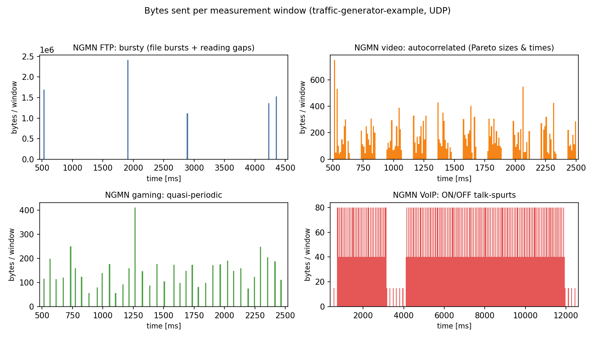
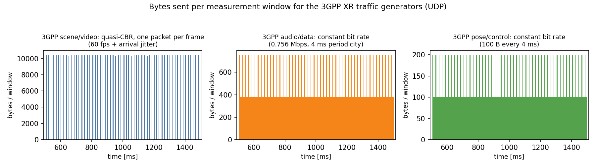

.. Copyright (c) 2026 Centre Tecnologic de Telecomunicacions de Catalunya (CTTC)
..
.. SPDX-License-Identifier: GPL-2.0-only

.. highlight:: cpp

Application layer
*****************
The 'NR' module ships application-layer traffic generators for realistic mixed-traffic and
extended-reality (XR) scenarios. They are implemented under ``nr/utils/traffic-generators`` on a
common ``TrafficGenerator`` C++ base class that supports many traffic types (video streaming, gaming,
VoIP, web browsing, FTP, scene/video, pose/control, audio/data); the implementation details are given
in [WNS32022-ngmn]_.

NGMN mixed traffic models
=========================
The NGMN traffic models, defined in Annex A and Annex B of [NGMN-traffics]_, simulate mixed-traffic
scenarios in which a percentage of the users is each associated with a different traffic type. NGMN
provides models for FTP, web browsing using HTTP, video streaming, VoIP and gaming. The module
includes:

* NGMN FTP
* NGMN video streaming
* NGMN gaming
* NGMN VoIP

The NGMN HTTP / web-browsing model is already available in |ns3|.

The traffic types differ markedly in how they emit bytes over time. :numref:`fig-traffic-patterns`
shows the bytes sent per measurement window for four NGMN generators, captured from the
``traffic-generator-example`` program: NGMN FTP is bursty (a whole file is sent, followed by a long
reading gap), NGMN video is self-similar / autocorrelated (heavy-tailed Pareto packet sizes and
inter-arrival times), NGMN gaming is quasi-periodic, and NGMN VoIP alternates ON/OFF talk-spurts. The
figure is produced by ``doc/source/figures/traffic/plot-traffic.py`` from the per-window byte counts
the example writes.

.. _fig-traffic-patterns:

   Bytes sent per measurement window for four NGMN traffic types (bursty, autocorrelated,
   quasi-periodic and ON/OFF).

3GPP XR traffic models
======================
The 3GPP traffic models for Extended Reality (XR) are defined in [TR38838]_ and cover Virtual Reality
(VR), Augmented Reality (AR) and Cloud Gaming (CG). They have been parameterized and combined to model
single- and multi-stream XR applications; a simulation helper combines the data flows (streams) of an
application into a single PDU session inside a network device. The module includes:

* 3GPP AR Model 3A, 3 streams: pose/control, scene/video and audio/data
* 3GPP VR downlink, 1 stream: scene/video
* 3GPP VR downlink, 2 streams: scene/video and audio/data
* 3GPP VR uplink: pose/control
* 3GPP CG downlink, 1 stream: scene/video
* 3GPP CG downlink, 2 streams: scene/video and audio/data
* 3GPP CG uplink: pose/control

In contrast with the NGMN sources above, the XR streams are periodic:
:numref:`fig-xr-traffic-patterns` shows the bytes sent per measurement window for the three
underlying generators. The scene/video stream is quasi-CBR -- one (possibly segmented) video frame
per frame interval (60 fps by default) with a small arrival jitter -- while the audio/data and
pose/control streams are pure constant-bit-rate sources (fixed packet size every 4 ms). The figure
is produced by ``doc/source/figures/traffic/plot-traffic-xr.py`` from per-window byte counts logged
with the same mechanism as :numref:`fig-traffic-patterns`.

.. _fig-xr-traffic-patterns:

   Bytes sent per measurement window for the 3GPP XR traffic generators (scene/video, audio/data
   and pose/control).
