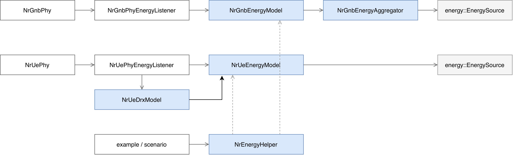
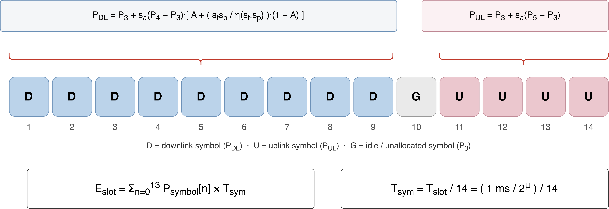
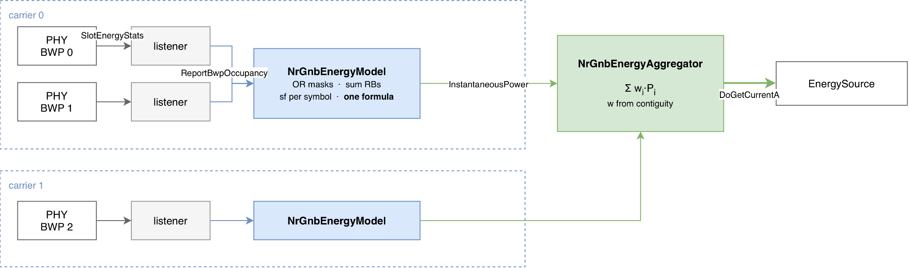
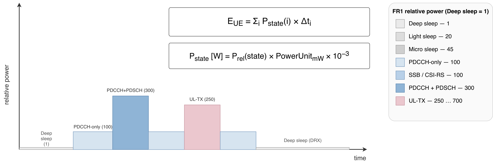

.. Copyright (c) 2026 University of Moratuwa
.. Copyright (c) 2026 Centre Tecnologic de Telecomunicacions de Catalunya (CTTC)
..
.. SPDX-License-Identifier: GPL-2.0-only

.. highlight:: cpp

Energy consumption model
************************
The NR module includes an energy consumption framework that models both the
base-station (gNB) and the user-equipment (UE) power draw over the course of a
simulation. The gNB side implements the base-station power model of [TR38864]_
(Section 5), and the UE side implements the device power model of [TR38840]_
(Section 8), together with a connected-mode DRX power model following the
[TS38321]_ timer semantics. The models are plugged into the standard ns-3
energy framework: ``NrGnbEnergyModel`` and ``NrUeEnergyModel`` derive from
``ns3::energy::DeviceEnergyModel`` and are attached to an
``ns3::energy::EnergySource`` (e.g. a ``BasicEnergySource``), so the consumed
energy depletes a battery reservoir like any other ns-3 device energy model.
Each model exposes ``State``, ``InstantaneousPower`` and
``TotalEnergyConsumption`` trace sources for logging.

Framework architecture
======================
The framework separates the *power model* (how much energy a state or a symbol
costs, per the 3GPP formulas) from the *event mapping* (what the radio is
actually doing at a given time). The power models never subscribe to PHY events
directly, instead thin listener objects bridge the two:

* ``NrGnbEnergyModel`` / ``NrUeEnergyModel``: the 3GPP power models. One
  ``NrGnbEnergyModel`` instance represents one component carrier (it can cover
  several bandwidth parts of that carrier, see :ref:`Multi-carrier and
  multi-BWP gNBs`).
* ``NrGnbEnergyAggregator``: only needed when a gNB uses more than one
  component carrier. It sums the power of every carrier's model with the
  weights TR 38.864 Section 5.1 gives for carrier aggregation, and is the
  object actually attached to the ``EnergySource`` in that case.
* ``NrUeDrxModel``: drives the UE between active monitoring and sleep.
* ``NrGnbPhyEnergyListener`` / ``NrUePhyEnergyListener``: subscribe to existing
  ``NrGnbPhy`` / ``NrUePhy`` trace sources and translate each per-slot or
  per-transport-block event into the corresponding power-model call.
* ``NrEnergyHelper``: a one-call installer that creates the models (and the
  aggregator, when there is more than one carrier), connects them to the
  caller-provided energy sources, and attaches the listeners (and, optionally,
  a DRX model) to the devices.

:numref:`fig-energy-arch` shows how these pieces fit together on the gNB and UE
sides.

.. _fig-energy-arch:

   Components of the NR energy framework and how ``NrEnergyHelper`` wires the
   power models, PHY listeners and DRX model to the gNB/UE PHYs and the ns-3
   energy sources. ``NrGnbEnergyAggregator`` only enters the picture for a
   multi-carrier gNB.

Because the mapping lives entirely in the listeners, the power models stay pure
and unit-testable against the 3GPP formulas, and a scenario can install the
energy stack without touching the PHY.

gNB energy model
================
The gNB power model follows [TR38864]_ Section 5. It combines a small set of
discrete relative power levels with dynamic downlink/uplink formulas, and
accumulates energy at the OFDM-symbol granularity.

Relative power levels
#####################
[TR38864]_ Table 5.1-3 defines five relative power values, :math:`P_1` (deep
sleep), :math:`P_2` (light sleep), :math:`P_3` (micro sleep, also the static
baseline), :math:`P_4` (active downlink) and :math:`P_5` (active uplink). The
values depend on both the base-station category and the reference configuration
set, so they are stored as a lookup table keyed by ``BsCategory`` and
``RefConfigSet``. For example, Category 1 / Set 1 uses
:math:`(P_1,\dots,P_5) = (1, 25, 55, 280, 110)`. A relative value is converted
to Watts by the ``PowerUnit`` attribute :math:`U` (Watts per relative unit),
which is one of the two free parameters of the model.

Dynamic downlink and uplink power
#################################
While transmitting, the instantaneous downlink power scales the dynamic part of
the active level by three activity factors defined in [TR38864]_ Section 5.1:
the active-antenna ratio :math:`s_a` (fraction of the transmit/receive units in
use), the allocated-bandwidth ratio :math:`s_f` (fraction of the resource blocks
used) and the transmit-power ratio :math:`s_p` (current transmit power relative
to the reference):

.. math::

   P_{DL} = P_3 + s_a\,(P_4 - P_3)\left[A + \frac{s_f\,s_p}{\eta(s_f,s_p)}\,(1 - A)\right]

Here :math:`A` (attribute ``AntennaRatio_A``, default 0.4) is the
load-independent fraction of the dynamic downlink power, and it is the second
free parameter of the model. The term :math:`\eta(s_f,s_p)` is the power-amplifier
efficiency: it is either a single constant :math:`1.0`, or, in the dual-efficiency
mode, :math:`\eta = 1.0` when :math:`s_f\,s_p \ge 0.5` and :math:`0.76` otherwise.
The uplink is simpler, as it has no :math:`s_f`/:math:`s_p` dependence:

.. math::

   P_{UL} = P_3 + s_a\,(P_5 - P_3)

:math:`s_f` and :math:`s_p` are measured from the live scheduler output (see
:ref:`PHY listeners`): :math:`s_f` is the used resource elements divided by
(available resource blocks :math:`\times` used symbols), evaluated once per
*carrier* on the combined occupancy of every bandwidth part it contains, not
per bandwidth part (see :ref:`Multi-carrier and multi-BWP gNBs`), and
:math:`s_p` is the current transmit power divided by the reference transmit
power, both in linear scale. :math:`s_a` is not currently measured: 5G-LENA
has no model for switching antenna/TRxRU elements off, so the model always
uses :math:`s_a = 1` (all transmit/receive units active). ``GetLastSa()``
exists on the listener for when that changes, but nothing feeds it a value
other than 1 today.

Symbol-level slot energy
########################
Rather than charging a whole slot at a single power level, the model accounts
energy per OFDM symbol (TR 38.864 Section 5.2). Every symbol of a slot is
classified as downlink, uplink or idle, evaluated at the corresponding power
(:math:`P_{DL}`, :math:`P_{UL}` or the micro-sleep baseline :math:`P_3`), and the
slot energy is the sum over the 14 symbols:

.. math::

   E_{slot} = \sum_{n=0}^{13} P_{symbol}[n]\,T_{sym},
   \qquad
   T_{sym} = \frac{T_{slot}}{14} = \frac{1}{14}\,\frac{1\,\text{ms}}{2^{\mu}}

where :math:`\mu` is the numerology and :math:`T_{sym}` is sourced from the PHY
(``NrGnbPhy::GetSymbolPeriod``). An idle symbol is one that no variable-TTI
allocation covers; it is not the 3GPP "flexible" slot type, since a fully
scheduled flexible slot is already resolved into definite downlink and uplink
symbols. :numref:`fig-energy-gnb` illustrates the per-symbol accounting over a
slot.

.. _fig-energy-gnb:

   gNB per-symbol slot energy (TR 38.864): each of the 14 symbols is charged at
   the downlink, uplink or idle power and summed over the slot.

Multi-carrier and multi-BWP gNBs
#################################
A gNB device can use several bandwidth parts, and those bandwidth parts can
belong to one component carrier or to several. The model treats these two
cases differently, because [TR38864]_ Section 5.1 says :math:`s_f` (the
bandwidth utilization ratio) is the ratio between the occupied bandwidth and
the maximum system bandwidth *of one CC*, so it is meant to be worked out once
per carrier and not once per bandwidth part.

Bandwidth parts of the same carrier report their occupied symbols (through
``NrGnbEnergyModel::BwpOccupancy``) to one shared ``NrGnbEnergyModel``. The
model takes the union of what every bandwidth part is doing in each symbol
(a symbol counts as busy for the carrier if any of its bandwidth parts uses
it) and evaluates the :math:`P_{DL}` / :math:`P_{UL}` formula once on that
combined occupancy. Doing it this way avoids counting the static baseline
:math:`P_3` and the antenna share :math:`A` more than once for the same piece
of hardware, which is what would happen if each bandwidth part got its own
formula evaluation and the results were simply added.

Different component carriers are combined the opposite way: each carrier
keeps its own complete ``NrGnbEnergyModel`` (its own :math:`P_3` and
:math:`A`, since it is a different RF chain), and ``NrGnbEnergyAggregator``
sums the carriers' instantaneous power. TR 38.864 Section 5.1 gives every
additional *contiguous* intra-band carrier a 0.7 weight instead of 1.0:

.. math::

   P_{device} = \sum_i w_i\,P_i(t), \qquad
   w_i = \begin{cases} 1.0 & \text{first carrier of a contiguous run} \\
                        0.7 & \text{additional contiguous carrier} \end{cases}

The aggregator does not take the weights as input. ``NrEnergyHelper`` passes
it each carrier's band id and frequency edges when it is installed, and the
aggregator sorts the carriers by frequency and works out which ones are
touching in the real spectrum, so the 0.7 discount follows from where the
carriers actually sit and is not something the user has to set by hand.
:numref:`fig-energy-ca` shows both rules at once: two bandwidth parts folded
into carrier 0's one model, next to carrier 1 with its own model, both fed
into the aggregator.

.. _fig-energy-ca:

   Bandwidth parts of the same carrier merge into one ``NrGnbEnergyModel``
   evaluation; carriers keep separate models and are summed by
   ``NrGnbEnergyAggregator`` with weights derived from spectrum contiguity.

Numerology limitation
######################
Combining bandwidth parts by their occupied symbol index only makes sense if
every bandwidth part of the carrier uses the same numerology, since the
symbol grid (and so the symbol duration) is different for each numerology,
and the model keeps one symbol duration per carrier. If two bandwidth parts
of one carrier report different symbol durations, ``NrGnbEnergyModel`` stops
with an assertion rather than silently combining symbols that do not line up
in time.

5G-LENA itself allows different numerologies on different bandwidth parts, so
this is a real limitation of the energy model, not of the simulator. A
mixed-numerology carrier can still be modeled today by giving each bandwidth
part its own carrier (so each gets its own ``NrGnbEnergyModel``, at the cost
of accepting the aggregator's per-carrier baseline for each one instead of
one shared baseline). The fix that keeps a shared baseline is to stop
reporting occupancy as a fixed-size array indexed by symbol number, and
instead report the real start and end time of each occupied symbol; combining
bandwidth parts would then mean walking the timeline formed by all reported
intervals instead of assuming they share one grid. This is left as future
work; see :ref:`Limitations`.

UE energy model
===============
The UE power model follows [TR38840]_ Section 8. It holds a current power state
and, on each state change, integrates the energy spent in the previous state
into a running total.

Power states
############
[TR38840]_ Table 18 defines the relative power of each UE state, normalized so
that deep sleep equals 1. The states are deep sleep, light sleep, micro sleep,
PDCCH-only monitoring, SSB/CSI-RS processing, PDCCH+PDSCH reception and uplink
transmission. Two tables are provided, one per frequency range (FR1 and FR2),
selected by the ``FreqRange`` attribute; the absolute power is the relative
value times the ``PowerUnit`` attribute (in mW per relative unit). Unlike the
gNB, the UE energy is state-based rather than per-symbol: the consumed energy is
the area under the power-versus-time curve, as illustrated in
:numref:`fig-energy-ue`.

.. _fig-energy-ue:

   UE state-based energy (TR 38.840): the UE moves between discrete power states
   over time and the energy is :math:`\sum_i P_{state}(i)\,\Delta t_i`.

Active-state scaling
####################
For the active downlink reception states, [TR38840]_ Section 8.1.3 defines three
multiplicative scalings that the model caches and applies on top of the relative
value. The bandwidth-part scaling reduces the power on narrower BWPs:

.. math::

   \text{scale}(X) = 0.4 + 0.6\,\frac{X - 20}{80}

for an active BWP bandwidth :math:`X` in MHz, clamped so the scaled active power
never falls below the BWP transition floor. This formula is [TR38840]_'s FR1
curve; the model currently reuses it for FR2 as well, since the standard does
not give a separate FR2 anchor pair, and logs a warning when it does so. FR2
BWP scaling is therefore approximate. The receive-antenna scaling applies
one factor of :math:`0.7` for each halving of the active receive chains relative
to the reference (:math:`P_{2Rx} = 0.7\,P_{4Rx}`), and the PDCCH blind-decoding
reduction is

.. math::

   P(\alpha) = \alpha + (1 - \alpha)\,0.7

for a candidate ratio :math:`\alpha \in (0, 1]`. Sleep and uplink states are left
unscaled.

Uplink transmit power
#####################
The uplink relative power is level-dependent. In FR1 it is linearly interpolated
between the [TR38840]_ Table 18 anchors of 250 (at 0 dBm) and 700 (at 23 dBm):

.. math::

   P_{UL,rel} = 250 + \frac{\min(P_{tx}, 23)}{23}\,(700 - 250)

so that transmit power control is reflected in the UE energy. FR2 uses a single
uplink value.

State transitions
#################
Deep and light sleep are not free to enter: [TR38840]_ Table 19 charges an
additional transition energy on top of the state power for a fixed transition
time (deep sleep: +450 relative units for 20 ms; light sleep: +100 for 6 ms;
micro sleep: none). This is modelled as a transient that rides on top of the
current state power for the transition duration and then settles, configurable
through the ``SetupTransitionPower`` and ``SetupTransitionTime`` attributes.

Connected-mode DRX
==================
5G-LENA has no MAC C-DRX engine, so for power-saving evaluation ``NrUeDrxModel``
runs the DRX timers on the ns-3 scheduler and toggles the UE energy model
between active monitoring and sleep, following the [TS38321]_ semantics. Each
long cycle begins with an *onDuration* window in which the UE monitors PDCCH; a
transport block (re)starts the *inactivity timer* and keeps the UE awake; when
the onDuration ends with no running inactivity timer, or the inactivity timer
expires, the UE sleeps until the next cycle. The sleep depth is chosen by the
gap to the next onDuration: a gap at least ``DeepSleepThreshold`` long uses deep
sleep, otherwise light sleep, reflecting that deeper sleep only amortizes its
transition cost over long inactive periods. It is a power model for energy
evaluation, not a protocol-accurate MAC DRX: it does not gate the scheduler, it
only decides the UE power state over time.

PHY listeners
=============
The listeners are the only components aware of both the PHY and the power model.
``NrGnbPhyEnergyListener`` subscribes to the ``NrGnbPhy`` per-slot statistics
trace, extracts :math:`s_a`, :math:`s_f` and :math:`s_p` from the reported
resource usage and transmit power, and drives the gNB model symbol by symbol,
charging downlink symbols at :math:`P_{DL}`, uplink symbols at :math:`P_{UL}` and
unallocated symbols at :math:`P_3`. ``NrUePhyEnergyListener`` subscribes to the
``NrUePhy`` downlink/uplink transport-block traces and moves the UE model into
PDCCH+PDSCH or uplink transmission for the active slot, returning to PDCCH-only
monitoring one slot later; it also re-applies the BWP scaling when the active BWP
bandwidth changes, and restarts the DRX inactivity timer on each transport
block. If no energy model is attached, the listener callbacks are no-ops.

The UE listener only reacts to DL/UL transport blocks and to DRX-driven PDCCH
monitoring: it has no separate accounting for a PDCCH occasion that carries no
grant, or for PUCCH/SRS transmissions. Since ``NrUePhy`` only fires a trace
when there is an uplink transport block, a slot where the UE sends only PUCCH
or SRS (no PUSCH) currently leaves the UE model in ``PDCCH_ONLY``, so that
transmission's power is not counted.

Calibration of the free parameters
==================================
The 3GPP relative power table is kept fixed; only the two knobs ``PowerUnit``
(:math:`U`) and ``AntennaRatio_A`` (:math:`A`) are calibrated to a target power
trace. At fixed :math:`s_a = 1` and :math:`s_p = 1`, the downlink power is affine
in the load :math:`s_f`:

.. math::

   P_{DL}(s_f) = U\left[P_3 + (P_4 - P_3)\big(A + s_f\,(1 - A)\big)\right]
   = b + m\,s_f

Given a set of measured (load, power) pairs :math:`(x_i, y_i)`, an ordinary
least-squares (OLS) fit of a straight line :math:`y = b + m\,x` recovers the
slope and intercept

.. math::

   m = \frac{\sum_i (x_i - \bar{x})(y_i - \bar{y})}{\sum_i (x_i - \bar{x})^2},
   \qquad
   b = \bar{y} - m\,\bar{x}

Matching coefficients between the closed form and the fitted line gives the
intercept :math:`b = U[P_3 + (P_4 - P_3)A]` and the slope
:math:`m = U(P_4 - P_3)(1 - A)`, which invert to the two attributes:

.. math::

   U = \frac{b + m}{P_4},
   \qquad
   A = \frac{\,b/U - P_3\,}{P_4 - P_3}

This keeps the model spec-compliant (the relative power ladder is unchanged)
while fitting its absolute scale and antenna split to the target in closed form.

Helper and usage
================
``NrEnergyHelper`` reduces the whole integration to two calls. The caller
installs standard ns-3 energy sources (one per node) and passes them, index
aligned with the device containers, to the helper:

.. code-block:: cpp

   NrEnergyHelper energyHelper;
   energyHelper.EnableDrx(true); // optional
   auto gnbModels = energyHelper.InstallGnb(gnbDevs, gnbSources);
   auto ueModels  = energyHelper.InstallUe(ueDevs, ueSources);

For each device the helper creates the energy model, connects it to the matching
energy source, and attaches the PHY listener (and, when ``EnableDrx`` is set, an
``NrUeDrxModel`` per UE). The returned ``DeviceEnergyModelContainer`` is the
source of truth for the consumed energy: read it with
``GetTotalEnergyConsumption()`` after the run. This form of ``InstallGnb``
treats every bandwidth part of the device as belonging to one carrier, which
covers most scenarios. The ``gsoc-nr-energy-example`` example shows this full
flow, from installing the sources to reading the per-device energy. See
:ref:`gsoc-nr-energy-example.cc`.

For a gNB with more than one component carrier, pass the operation bands
instead, and ``InstallGnb`` figures out which bandwidth part belongs to which
carrier and installs an ``NrGnbEnergyAggregator`` automatically
(:ref:`Multi-carrier and multi-BWP gNBs`):

.. code-block:: cpp

   auto gnbModels = energyHelper.InstallGnb(gnbDevs, gnbSources, bands);

On the UE side, ``InstallUe(ueDevs, ueSources)`` attaches the listener to
bandwidth part 0 of every device, which is what most single-BWP scenarios
want. A third argument picks a different bandwidth part when a group of UEs
is meant to be observed on another one:

.. code-block:: cpp

   auto ueModels = energyHelper.InstallUe(ueDevs, ueSources, /* bwpIndex = */ 1);

The ``gsoc-nr-energy-ca-example`` example builds on this: it sets up several
component carriers, each with its own bandwidth parts, and shows the
aggregated per-carrier energy that comes out of it. See
:ref:`gsoc-nr-energy-ca-example.cc`.

Limitations
===========
This section lists the assumptions and limitations of the energy framework
that a user should know before relying on its output, gathered in one place
since each is otherwise only visible where it is implemented.

Calibration and the shared assumptions
#######################################
* **PowerUnit is a calibration assumption, not a 3GPP value.** [TR38864]_
  and [TR38840]_ only define *relative* power tables; they do not say what a
  relative unit is worth in Watts for a given device. ``PowerUnit`` (and, on
  the gNB side, ``AntennaRatio_A``) is what the user sets to match a target
  device or trace, as described in :ref:`Calibration of the free parameters`.
  There is no built-in default that is claimed to be an absolute, validated
  power figure for any real product.
* **The active-antenna ratio** :math:`s_a` **is always 1.** 5G-LENA has no
  model for switching antenna/TRxRU elements off, so both the gNB and UE
  energy models always see full antenna activity. See
  :ref:`Dynamic downlink and uplink power`.
* **Simultaneous FDD DL/UL neglects UL power by default.** The
  ``NeglectUlDuringDl`` attribute on ``NrGnbEnergyModel`` defaults to
  ``true``, reproducing [TR38864]_ Section 5.1's own simplification for FDD
  ("the power for UL reception is neglected in this study"). Setting it to
  ``false`` adds the UL dynamic power on top of the DL power instead; a real
  FDD base station does consume power receiving while it transmits, which is
  why the attribute exists.
* **gNB deep/light sleep have no automatic controller.** The model can
  represent :math:`P_1`/:math:`P_2` (deep/light sleep) and charges their
  [TR38840]_-style entry transient, but nothing in the framework decides on
  its own to put a gNB to sleep based on traffic; a scenario has to call
  ``ChangeState()`` itself if it wants to model cell DTX/sleep.

gNB side
########
* **Bandwidth parts of one carrier must share a numerology.** See
  :ref:`Numerology limitation`.

UE side
#######
* **A UE only observes one bandwidth part at a time.** ``NrUeEnergyModel``
  keeps a single current power state, so ``NrEnergyHelper::InstallUe`` can
  attach the listener to only one bandwidth part per UE (any one, chosen by
  the ``bwpIndex`` argument, see :ref:`Helper and usage`). A UE actually
  using several bandwidth parts at once (for example separate uplink and
  downlink BWPs) does not get all of its activity accounted today.
* **Dedicated PDCCH occasions, PUCCH and SRS are not accounted.** The UE
  listener only reacts to DL/UL transport blocks and DRX-driven PDCCH
  monitoring; see :ref:`PHY listeners`. A slot where the UE only sends PUCCH
  or SRS, with no PUSCH, is not currently detected and its power is not
  counted.
* **CSI-RS/SSB reception has no dedicated power state.** ``NrUePhy`` does not
  currently expose a trace source for CSI-RS or SSB reception, so the energy
  listener has nothing to drive a corresponding power state from, even though
  [TR38840]_ defines one.
* **FR2 BWP scaling reuses the FR1 curve.** See :ref:`Active-state scaling`;
  the result is approximate for FR2 and the model logs a warning when it
  applies.
* **No MAC C-DRX in 5G-LENA.** As already noted in :ref:`Connected-mode DRX`,
  ``NrUeDrxModel`` is a power-evaluation model layered on top of the
  scheduler, not a real DRX-aware MAC: it does not change what the scheduler
  grants, only how the UE's power state is derived from a chosen DRX
  configuration.

The model has also been checked against real measured power; see
:ref:`Energy consumption model validation`.
