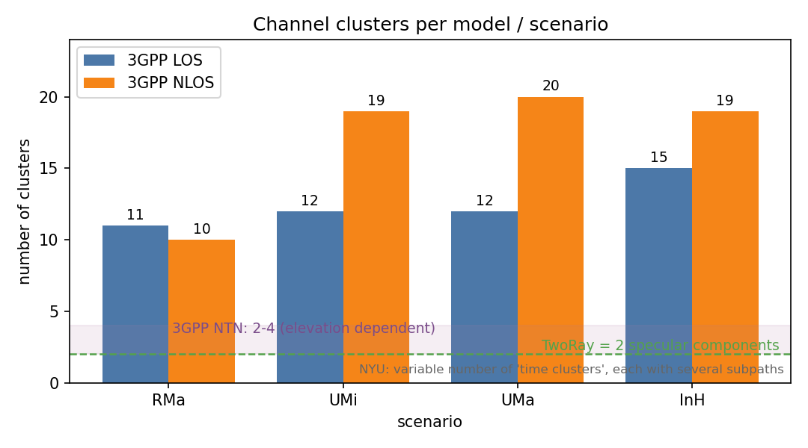

.. Copyright (c) 2026 Centre Tecnologic de Telecomunicacions de Catalunya (CTTC)
..
.. SPDX-License-Identifier: GPL-2.0-only

.. highlight:: cpp

Helpers
*******
The 'NR' module ships a number of helpers that simplify common simulation tasks: generating
radio environment maps, configuring spectrum channels, and the traffic-model, fronthaul-control,
NR-U and NR V2X extensions. Each is described below.

NR REM Helper
=============

The purpose of the ``NrRadioEnvironmentMapHelper`` is to generate rem maps, where
for each point on the map (rem point) a rem value is calculated (SNR/SINR/IPSD).
The IPSD (Interference Power Spectral Density) corresponds to the aggregated
received power of all signals at each rem point (treated as interference).

For the nr radio environment helper we have introduced the following terminologies\:
 * RTD(s) -> rem transmitting device(s)
 * RRD -> rem receiving device

As general case, the rem point is configured according to the RRD passed to the
``NrRadioEnvironmentMapHelper`` (e.g. antenna configuration).

Two general types of maps can be generated according to whether the BeamShape
or CoverageArea is selected.
The first case considers the configuration of the beamforming vectors (for each
RTD) as defined by the user in the scenario script for which the REM maps
(SNR/SINR/IPSD) are generated. Examples are given in :numref:`fig-BSexamples`
where the first two figures depict the SNR (left) and SINR (right) for the case
of two gNBs with antenna array configuration 8x8 and Isotropic elements, while
the two figures on the bottom correspond to 3GPP element configuration.

.. _fig-BSexamples:

.. figure:: figures/BSiso3gpp.*
   :align: center
   :scale: 50 %

   BeamShape map examples (left: SNR, right: SINR)

In the second case, the beams are reconfigured during the map generation for
each rem point in order to visualize the coverage area in terms of SNR, SINR
and IPSD. Examples of the SNR (left) and SINR (right) CoverageArea maps for two
gNBs with Isotropic/3GPP (top/bottom) antenna elements are presented in
:numref:`fig-CAexamples`.

.. _fig-CAexamples:

.. figure:: figures/CAiso3gpp.*
   :align: center
   :scale: 50 %

   CoverageArea map examples (left: SNR, right: SINR)

The ``NrRadioEnvironmentMapHelper`` allows also the visualization of the coverage
holes when buildings are included in the deployment. An example is given in
:numref:`fig-CAexamplesBuildings`, where Isotropic antenna elements were
configured to both gNBs of the example.

.. _fig-CAexamplesBuildings:

.. figure:: figures/CAexamplesBuildings.*
   :align: center
   :scale: 50 %

   CoverageArea map examples with buildings (left: SNR, right: SINR)

An example for a hexagonal deployment is given in :numref:`fig-S3`. In this
example the REM depicts a scenario for the frequency band of 2GHz, BW of 10 MHz,
while the Inter-Site Distance (ISD) has been set to 1732m for the Urban case (top)
and 7000m for the Rural case (bottom). The transmit power has been set to 43 dBm.

.. _fig-S3:

.. figure:: figures/UmaRma.*
   :align: center
   :scale: 50 %

   Hexagonal Topology (BeamShape) map examples (left: SNR, right: SINR)

Finally, :numref:`fig-HetNet` presents an example of a Heterogeneous Network
(HetNet) of 7 Macro sites and 3 randomly deployed Small Cells.

.. _fig-HetNet:

.. figure:: figures/HetNet.*
   :align: center
   :scale: 75 %

   Heterogeneous Network map example (left: SNR, right: SINR)

The ``NrRadioEnvironmentMapHelper`` gives the possibility to generate maps either
for the DL or the UL direction. This can be done by passing to the rem helper
the desired transmitting device(s) (RTD(s)) and receiving device (RRD), which
for the DL case correspond to gNB(s) and UE, respectively, while for the UL
case to UE(s) and gNB, respectively. An example of an UL case is given in
:numref:`fig-UlRemHex`, for the hexagonal topology presented in :numref:`fig-S3`
above (Urban case), for 324 UEs with UE transmit power 23 dBm, antenna height 1.5m
and 1x1 antenna array.

.. _fig-UlRemHex:

.. figure:: figures/UlRemHex.*
   :align: center
   :scale: 50 %

   UL REM map example (IPSD)

In addition, an UL map can be generated to visualize the coverage area of a tx
device (UE), while there is the possibility to add interference from DL gNB
device(s) to study a worst case mixed FDD-TDD scenario.

Let us notice that for the SNR/SINR/IPSD calculations at each REM Point the
channel is re-created to avoid spatial and temporal dependencies among
independent REM calculations. Moreover, the calculations are the average of
N iterations (specified by the user) in order to consider the randomness of
the channel.

NR Channel Helper
=================

This class consolidates the configuration of channel models in 5G-LENA.
It also prevents users from inadvertently mixing incompatible channel conditions, scenarios and models.
Currently, the class supports the NYUSIM and Fluctuating Two-Ray (FTR) models and the previously supported 3GPP channel model and their scenarios and conditions.
Moreover, the class allows for potential extensions to support legacy models already present in ns-3 (e.g., Friis, Constant), for faster but less realistic channel models.
Notice that SU-MIMO implementation is currently supported only by 3GPP channel model. Other models, like NYU and FTR would need to be extended in order to be used
in SU-MIMO simulations. For example, these models do not generate frequency domain spectrum channel matrix (whose dimensions are the number of RX ports,
the number of TX Ports, and the number of resource blocks (RBs)), which is needed by 5G-LENA SU-MIMO model to calculate the SINR.

**Scenarios:**
- Rural Macro (RMa)
- Urban Macro (UMa)
- Indoor Hotspot in an open plan office scenario (InH-OfficeOpen)
- Indoor Hotspot in a mixed plan office scenario (InH-OfficeMixed)
- Vehicle-to-vehicle in a highway scenario (V2V-Highway)
- Vehicle-to-vehicle in an urban scenario (V2V-Urban)
- Urban Micro (UMi)
- Indoor Hotspot (InH)
- Indoor Factory (InF)
- Non-Terrestrial Network in a dense urban scenario (NTN-DenseUrban)
- Non-Terrestrial Network in an urban scenario (NTN-Urban)
- Non-Terrestrial Network in a suburban scenario (NTN-Suburban)
- Non-Terrestrial Network in a rural scenario (NTN-Rural)
- Custom user-scenario

**Conditions:**
- Always line-of-sight (LOS)
- Never line-of-sight (NLOS)
- Buildings
- Default

**Channel Models:**
- ThreeGpp
- TwoRay
- NYU
- SionnaRT

**NOTE:** The 'Default' channel condition model is defined by the scenario,
which means that the channel condition will be evaluated based on the
scenario selected by the user (e.g., Urban Macro → 'ThreeGppUmaChannelConditionModel').

This class ensures that the user selects only supported and calibrated combinations.
In other words, the simulation will be immediately aborted if a user attempts to choose
a NYUSIM scenario and the 3GPP channel. These supported combinations only consider the scenario
and channel model defined by the user, as all channel models within the scope of this class support
all possible user-select channel conditions. Additionally, it is essential to note that
since the FTR model also uses the propagation loss and channel conditions from the 3GPP model,
the valid combinations for 3GPP will also apply to the FTR model. The simulation will only be
aborted if the chosen scenario has not yet been calibrated for the FTR model.

:numref:`fig-nr-channel-condition` shows how the ``ChannelCondition`` selector maps to the underlying
``ChannelConditionModel`` classes.

.. _fig-nr-channel-condition:

.. figure:: figures/channel/channel-condition.*
   :align: center

   Channel-condition options and the condition models they select.

The supported (channel model, scenario) combinations are:

.. list-table:: Supported channel-model / scenario combinations
   :header-rows: 1

   * - Channel model
     - Supported scenarios
   * - ThreeGpp (also TwoRay and SionnaRT, which reuse the 3GPP propagation and condition models)
     - RMa, UMi, UMa, InH-OfficeMixed, InH-OfficeOpen, V2V-Highway, V2V-Urban, NTN-DenseUrban,
       NTN-Urban, NTN-Suburban, NTN-Rural
   * - NYU
     - RMa, UMa, UMi, InH, InF

The number of multipath clusters differs markedly between models, which is one reason the
combinations are constrained. :numref:`fig-nr-cluster-count` compares them: the 3GPP terrestrial
scenarios use the per-scenario cluster counts of TR 38.901 (about 10-20), the 3GPP NTN scenarios use
only 2-4 clusters (elevation dependent), the Fluctuating Two-Ray (``TwoRay``) model uses exactly two
specular components, and NYU draws a variable number of "time clusters" (each with several subpaths).

.. _fig-nr-cluster-count:

   Number of channel clusters per model and scenario.

The ``NrChannelHelper`` also facilitates the automatic creation of spectrum channel objects and assigns
multiple identical channels to the BWPs created by the user, respecting their BWPs central frequency assignments.
The chosen combination must first be configured, which will then be applied to the object factories.
Moreover, users also have the option to configure the objects manually, subsequently create the spectrum channels,
and assign them to the desired BWPs manually.

Fronthaul Control
=================
Fronthaul Control is implemented in the ``NrFhControl`` class. It allows to simulate a
limited-capacity fronthaul (FH) link in the downlink direction based on the FhCapacity
set by the user, and to apply FH control methods in order to restrict user allocations,
if they do not fit in the available FH capacity.

The functional split determines where the downlink processing chain is cut between the Distributed
Unit (DU, centralized) and the Radio Unit (RU), and therefore how much data must cross the fronthaul.
``NrFhControl`` models four splits, selected through the ``FunctionalSplit`` attribute (``FS_6``,
``FS_7_3``, ``FS_7_2`` and ``FS_7_1``); ``FS_7_2`` is the default. :numref:`fig-nr-fh-splits` shows
where each split cuts and how it scales the fronthaul bit-rate, from the lightest (``FS_6``, which
transports MAC-level data scaled by MCS and rank) to the heaviest (``FS_7_1``, which transports
frequency-domain IQ samples per antenna port). ``FS_7_2`` transports IQ samples per layer and supports
optional modulation compression (the ``EnableDynamicModComp`` / ``OverheadDyn`` attributes).

.. _fig-nr-fh-splits:

.. figure:: figures/fh/functional-splits.*
   :align: center

   Fronthaul functional splits modelled by ``NrFhControl`` and their relative fronthaul load.

When the Fronthaul Control is activated, an instance of the NrFhControl is created per
cell. Notice, that if a cell is configured with more than 1 BWPs, the available fronthaul
capacity will be shared among the active BWPs.

NrFhControl gets as inputs the available fronthaul capacity, the fronthaul control method
to be applied (i.e., Dropping, Postponing, OptimizeMcs and OptimizeRBs) that will restrict
user allocations, and the dynamic overhead to implement modulation compression.

The ``NrHelper`` is responsible for the creation of the ``NrFhControl`` instance, while a set
of SAPs (``NrFhSchedSapProvider``, ``NrFhSchedSapUser``, ``NrFhPhySapProvider``, ``NrFhPhySapUser``)
have been implemented to allow bidirectional exchange of information with the MAC scheduler and the
PHY layer. Based on these interactions (and the fronthaul control method applied), they will
limit allocations in case it is instructed by the Fronthaul Control.

The ``NrFhControl``  keeps track of the active UEs with new data in their RLC queues and the active
UEs with HARQ data, through the collection of information from the MAC layer. Once a BSR is received,
the MAC calls the NrFhControl, (through the ``NrFhSchedSapProvider`` interface), to store the UE
(for which the BSR has been received) in a map containing the active UEs along with the amount of bytes
of each of the UEs. For the case of active HARQ UEs, once the scheduling process is initiated, the MAC
calculates the active HARQ UEs and communicates this list to the NrFhControl. Finally, when the scheduling
process is finalized, the MAC calls the NrFhControl to update the map of the active UEs and the bytes
stored based on the performed scheduling decisions.

For more details with respect to the theoretical background, the fronthaul control methods and the
evaluation of the impact that the fronthaul limitations can have on the end-to-end throughput and delay
please refer to the paper [ComNetFhControl]_.
