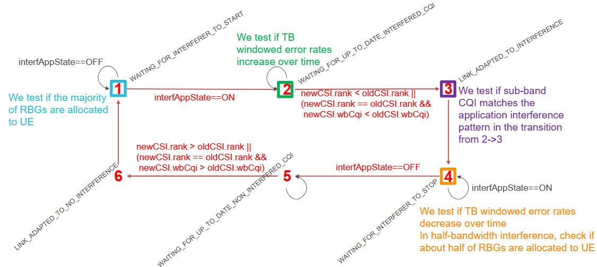

.. Copyright (c) 2026 Centre Tecnologic de Telecomunicacions de Catalunya (CTTC)
..
.. SPDX-License-Identifier: GPL-2.0-only

.. highlight:: cpp

Tests
*****
To validate the implemented features, we have designed different tests.

NR test for new NR frame structure and numerologies configuration
=================================================================
Test case ``nr-system-test-configurations`` validates that the NR frame structure is correctly
configured by using new configuration parameters.
This is the system test that is validating the configuration of
different numerologies in combination with different schedulers.
The test provides the traces according to which can be checked whether
the gNB and UE clocks perform synchronously according the selected numerology,
and that serialization and deserialization of the frame, subframe, slot and TTI number
performs correctly for the new NR frame structure.

The complete details of the validation script are provided in
https://cttc-lena.gitlab.io/nr/html/nr-system-test-configurations_8cc.html

Test of packet delay in NR protocol stack
=========================================
Test case ``nr-test-numerology-delay`` validates that the delays of a single
UDP packet are correct.
UDP packet is monitored at different points of NR protocol stack,
at gNB and UE. The test checks whether the delay corresponds to
configuration of the system for different numerologies.

.. _fig-protocol-stack:

.. figure:: figures/protocol-stack.*
   :align: center
   :scale: 60%

   Performance evaluation of packet delay in NR protocol stack

The test monitors delays such as, gNB processing time, air time, UE time, etc.
The test fails if it detects unexpected delay in the NR protocol stack.
The test passes if all of the previous steps are according to the
timings related to a specific numerology. The test is run for different
numerologies.

The complete details of the validation script are provided in
https://cttc-lena.gitlab.io/nr/html/nr-test-numerology-delay_8cc.html

Test for CC/BWP
===============
Test case called ``nr-cc-bwp-configuration`` validates that the creation of operation bands, CCs and BWPs is correct within the limitations of the NR implementation. The main limitation of BWPs is that they do not overlap, because in such case, the interference calculation would be erroneous. This test also proves that the creation of BWP information with the CcBwpHelper is correct.

The complete details of the validation script are provided in
https://cttc-lena.gitlab.io/nr/html/nr-cc-bwp-configuration_8cc.html

Test of numerology FDM
======================
To test the FDM of numerologies, we have implemented the ``nr-test-fdm-of-numerologies-dl-4``, ``nr-test-fdm-of-numerologies-dl-2``, ``nr-test-fdm-of-numerologies-ul-4`` and ``nr-test-fdm-of-numerologies-ul-2`` test suites, in which the gNB is configured to operate with 2 BWPs. The test checks if the achieved throughput of a flow over a specific BWP is proportional to the bandwidth of the BWP through which it is multiplexed. The scenario consists of two UEs that are attached to a gNB but served through different BWPs, with UDP full buffer downlink traffic. Since the traffic is full buffer traffic, it is expected that when more bandwidth is provided, more throughput will be achieved and vice versa.

The complete details of the validation script are provided in
https://cttc-lena.gitlab.io/nr/html/nr-test-fdm-of-numerologies_8cc.html

Test for NR schedulers
======================
To test the NR schedulers, we have implemented various system tests called
``nr-system-test-schedulers-tdma/ofdma-mr/pf/rr/random`` (the TDMA round-robin variant is
further split into the ``nr-system-test-schedulers-tdma-rr-dl``, ``-ul`` and ``-dl-ul``
suites) whose purpose is to test that the
NR schedulers provide a required amount of resources to all UEs, for both cases,
the downlink and the uplink. The topology consists of a single gNB and
variable number of UEs, which are distributed among variable number of beams.
Test cases are designed in such a way that the offered rate for the flow
of each UE is dimensioned in such a way that each of the schedulers under the
selected topology shall provide at least the required service to each of the UEs.
Different system tests cases are available for the various modes of scheduling (OFDMA and TDMA)
and different scheduling algorithms (RR, PR, MR, random) supported in the simulator.
For QoS and AI RL-based scheduler are created more specialized tests.
Each of the test cases checks different system configuration by choosing
different number of UEs, number of beams, numerology, traffic direction (DL, UL,
DL and UL).

The complete details of the validation scripts are provided in
https://cttc-lena.gitlab.io/nr/html/nr-system-test-schedulers-ofdma-mr_8cc.html,
https://cttc-lena.gitlab.io/nr/html/nr-system-test-schedulers-ofdma-pf_8cc.html,
https://cttc-lena.gitlab.io/nr/html/nr-system-test-schedulers-ofdma-rr_8cc.html,
https://cttc-lena.gitlab.io/nr/html/nr-system-test-schedulers-tdma-mr_8cc.html,
https://cttc-lena.gitlab.io/nr/html/nr-system-test-schedulers-tdma-pf_8cc.html,
https://cttc-lena.gitlab.io/nr/html/nr-system-test-schedulers-tdma-rr_8cc.html

The base class for all the scheduler tests is
https://cttc-lena.gitlab.io/nr/html/system-scheduler-test_8h.html

Test for NR QoS Schedulers
==========================
To test the correct functionality of the QoS MAC schedulers presented in :ref:`QosSchedulers`
we have implemented a system test, known as ``nr-system-test-schedulers-qos``. The
test in its current form verifies the implemented QoS MAC schedulers by checking
that the obtained throughput is as expected for the QoS scheduling logic. In
particular, it considers a scenario with 2 users, each one generating one traffic
flow with different priority, under good propagation conditions and without
retransmissions. Based on this priority, it checks if the ratio of the throughput
obtained is equal to the ratio of the priorities for the case that the generated
load saturates the system, i.e.:

:math:`\frac{100-P_1}{100-P_2} = \frac{Th_1}{Th_2}`

Let us point out that the test for the case of DC-GBR flows is envisioned to be
included in the short-term future.

Test for NR RL-based schedulers
===============================
To verify the correct functionality of the callback used for invoking the ns3-gym module
during the resource assignment process, we have implemented a unit test called ``nr-test-scheduler-ai``.
This test checks whether the callback is properly invoked during the resource assignment process
by comparing the passed observation with the details of the UEs and the installed flows in the UEs.

Test for NR error model
=======================
Test case called ``nr-test-l2sm-eesm`` validates specific functions of the NR
PHY abstraction model.
The test checks two issues: 1) LDPC base graph (BG) selection works properly, and 2)
BLER values are properly obtained from the BLER-SINR look up tables for different
block sizes, MCS Tables, BG types, and SINR values.

The complete details of the validation script are provided in
https://cttc-lena.gitlab.io/nr/html/nr-test-l2sm-eesm_8cc.html

Test for 3GPP antenna model
===========================
Test case called ``nr-antenna-3gpp-model-conf`` validates multiple configurations
of the antenna array model by checking if the throughput/SINR/MCS obtained is as
expected. The test scenario consists of one gNB and a single UE attached to the
gNB. Different positions of the UE are evaluated.

The complete details of the validation script are provided in
https://cttc-lena.gitlab.io/nr/html/nr-antenna-3gpp-model-conf_8cc_source.html

Test for TDD patterns
=====================
Test case called ``nr-lte-pattern-generation`` validates the maps generated from the function
``NrGnbPhy::GenerateStructuresFromPattern`` that indicate the slots that the DL/UL
DCI and DL HARQ Feedback have to be sent/generated, as well as the scheduling timings
(K0, K1, k2) that indicate the slot offset to be applied at the UE side for the reception
of DL Data, scheduling of DL HARQ Feedback and scheduling of UL Data, respectively.
The test calls ``NrGnbPhy::GenerateStructuresFromPattern`` for a number of possible
TDD patterns and compares the output with a predefined set of the expected results.

The complete details of the validation script are provided in
https://cttc-lena.gitlab.io/nr/html/nr-lte-pattern-generation_8cc.html

Test case called ``nr-phy-patterns`` creates a fake MAC that checks if, that
when PHY calls the DL/UL slot allocations, it does it for the right slot in pattern.
In other words, if the PHY calls the UL slot allocation for a slot that should be DL,
the test will fail.

The complete details of the validation script are provided in
https://cttc-lena.gitlab.io/nr/html/nr-phy-patterns_8cc.html

Test for channel creation via NrChannelHelper API
=================================================

Test case called ``nr-channel-setup-test``, a new API for channel configuration and creation, has been developed,
this test was created to validate this process. The test ensures the correct creation of channels and will fail
if any combination of channel, scenario, or channel conditions is not properly instantiated.

Test for spectrum phy
=====================
Test case called ``nr-spectrum-phy-test`` sets two times noise figure and validates that such a setting is applied correctly to connected classes of SpectrumPhy, i.e., SpectrumModel, SpectrumValue, SpectrumChannel, etc.

The complete details of the validation script are provided in
https://cttc-lena.gitlab.io/nr/html/nr-spectrum-phy-test_8h_source.html

Test for frame/subframe/slot number
===================================
Test case called ``nr-test-sfnsf`` is a unit-test for the frame/subframe/slot numbering, along with the numerology. The test checks that the normalized slot number equals a monotonically-increased integer, for every numerology.

The complete details of the validation script are provided in
https://cttc-lena.gitlab.io/nr/html/nr-test-sfnsf_8cc_source.html

Test for NR timings
===================
Test case called ``nr-test-timings`` checks the NR timings for different numerologies. The test is run for every numerology, and validates that the slot number of certain events is the same as the one pre-recorded in manually computed tables. We currently check only RAR and DL DCI messages, improvements are more than welcome.

The complete details of the validation script are provided in
https://cttc-lena.gitlab.io/nr/html/nr-test-timings_8cc_source.html

.. _notchingTest:

Test for notching
=================
Test case called ``nr-test-notching`` validates the notching functionality
(for more details please see :ref:`Notching`) for various beams, various number
of UEs per beam, TDMA RR and OFDMA RR and different notching masks, by checking
the RBG allocation to the different UEs.
In particular, the test creates a fake MAC and checks in the method
``TestNotchingGnbMac::DoSchedConfigIndication()`` that the RBG mask in the DCI
is constructed in accordance with the (tested) notching mask.

The complete details of the validation script are provided in
https://cttc-lena.gitlab.io/nr/html/nr-test-notching_8cc.html

Uplink power control tests
==========================
Test case called ``nr-uplink-power-control-test.cc`` validates that
uplink power control functionality works properly.
Test checks PUSCH and PUCCH power control adaptation.
According to test UE is being moved during the test to different
positions and then it is checked whether the UE transmission
power is adjusted as expected for different cases open loop, closed loop,
and absolute/accumulated mode. Shadowing is disabled to allow
deterministic pathloss values. And PoNominalPusch are configured
in a different way to test that the maximum power levels are reached
for the different distances for PUSCH and PUCCH::

    Config::SetDefault ("ns3::NrUePowerControl::PoNominalPusch", IntegerValue (-90));
    Config::SetDefault ("ns3::NrUePowerControl::PoNominalPucch", IntegerValue (-80));

The complete details of the validation script are provided in
https://cttc-lena.gitlab.io/nr/html/nr-uplink-power-control-test_8cc_source.html

Realistic beamforming test
==========================
The test ``nr-realistic-beamforming-test.cc`` included in the
`nr` module tests the realistic BF implementation.
It involves two devices, a transmitter and a receiver, placed at a certain
distance from each other and communicating over a wireless channel at 28 GHz carrier frequency.
The test compares the performance of two different BF methods: 1) the proposed realistic BF algorithm,
which uses Sounding Reference Signal (SRS) reception to estimate the channel and computes BF weights based on such channel estimate,
and 2) an ideal BF algorithm, which selects the BF weights assuming perfect knowledge of the
channel matrix coefficients.
The test checks that with low SINR from SRS, realistic BF algorithm makes more mistakes in
channel estimation than ideal BF algorithm. Also, the test checks that with high SINR from SRS,
realistic BF algorithm generates almost always the same decision as that of the ideal BF method,
and so, the same pair of beams are selected for the two communicating devices.

The complete details of the validation script are provided in
https://cttc-lena.gitlab.io/nr/html/nr-realistic-beamforming-test_8cc_source.html.

Test for NGMN traffic models
============================
Test case called ``traffic-generator-test`` validates the NGMN traffic models. It is composed of various tests cases that check that the traffic generator works correctly by validating that the probabilistic distributions of specific variables of each of the implemented traffic generators is according to the NGMN document.

TrafficGeneratorTestCase checks that the traffic generator is correctly being configured, connected to the socket, that different transport protocols can be used (TCP or UDP depending on the configuration), and that all the packets that are transmitted are correctly received. TrafficGeneratorNgmnFtpTestCase checks that the probability distributions of the NGMN FTP traffic generator are generated correctly. The test case calls 1000 times the function to generate the file size and the reading time of the NGMN FTP traffic generator, and it checks whether the mean file size value and the mean reading time correspond to those that are defined in the NGMN document. TrafficGeneratorNgmnGamingTestCase checks whether the mean value of the initial packet arrival time, the mean packet arrival time, and the mean packet size for the downlink and uplink NGMN gaming traffic generator have the expected values. TrafficGeneratorNgmnVideoTestCase checks that the probability distributions of the NGMN video traffic generator are generated correctly. The test case calls 1000 times the function to generate the packet size and the packet arrival time of the NGMN video traffic generator, and it checks whether the mean packet size value, and the mean packet arrival time correspond to those that are defined in the NGMN document. TrafficGeneratorNgmnVoipTestCase checks whether the implemented NGMN VoIP traffic generator provides the average source rate equal to the average VoIP source rate as defined in the NGMN document, i.e., the one of RTP AMR 12.2 traffic. For a given parameter specified in the NGMN document, such as encoder frame length, voice activity factor, etc.

The complete details of the validation script are provided in
https://cttc-lena.gitlab.io/nr/html/traffic-generator-test_8cc_source.html

Test for RI and PMI selection techniques
========================================

Test case called ``nr-test-ri-pmi`` is a system test used to verify the different RI/PMI selection techniques produce the expected results,
in terms of performance, mean rank and MCS. The test is setup like ``cttc-nr-mimo-demo``, with a single gNB-UE pair, generating traffic to fully saturate
the channel. The different RI and PMI techniques produce different precoding matrices, increasing or lowering the gain. The difference in gain
directly reflect on link adaptation, changing the rank and MCS selection, resulting in better or worse results in terms of throughput and latency.

The complete details of the validation script are provided in
https://cttc-lena.gitlab.io/nr/html/nr-test-ri-pmi_8cc.html

Test for CSI feedback with MIMO
===============================

Test case called ``nr-test-csi`` is a system test used to verify the CSI feedback works correctly without and with interference.
The test is setup with a main gNB-UE pair. The main UE is the measuring UE, that is used to collect the metrics used by the test.
In case we are testing with interference, a secondary gNB-UE pair is added. The interfered band of the secondary gNB-UE pair is
defined by an interference pattern, implemented using a notching mask to model the frequency domain and a ON-OFF application
to model the time domain. That interference pattern can be either wide-band, or narrow-band (occupying the upper or lower
half of the bandwidth), according to the notching mask.

To check if the interference is being properly detected by the CSI, we monitor the main UE, which must
traverse through the states of the following finite state machine shown in :numref:`fig-csi-test-fsm`.

.. _fig-csi-test-fsm:

   Finite state machine for interference detection with CSI

Many different combinations of interference measurement sources are tested, including ``CQI_PDSCH_SISO``,
``CQI_PDSCH_MIMO``, ``CQI_CSI_RS | CQI_CSI_IM`` and ``CQI_PDSCH_MIMO | CQI_CSI_RS | CQI_CSI_IM``
(see more details in :ref:`CSI-RS and CSI-IM`).
We also measure the main UE throughput using the wide-band and sub-band CQI scheduling
(see more details in :ref:`Scheduler`).

The rank, MCS, mean throughput throughout the simulation, the mean throughput over a sliding window,
and sub-band CQI reports over time are collected by the test-suite and stored into a JSON file for easy processing.
A companion script, ``nr-test-csi-plot.py``, can plot all the measurements for all the test cases, allowing for
the visual inspection of the behavior of the system during the simulation.

The complete details of the validation script are provided in
https://cttc-lena.gitlab.io/nr/html/nr-test-csi_8cc_source.html

Test for OFDMA time-domain schedulers (symbols per beam)
========================================================

Test case called ``nr-test-sched-ofdma-symbol-per-beam`` is a unit test used to verify the different time-domain
symbol per beam schedulers work correctly. The test performs a few checks for each of the implemented
schedulers:

- Try scheduling symbols to no beams.
- Try scheduling symbols to a beam with a single UE, CQI 15, 1B buffer.
- Try scheduling symbols to two beams. The first beam with a single UE, CQI 15, 1B buffer. The second beam with a single UE, CQI 2, 1MB buffer.
- Try scheduling symbols to two beams. The first beam with two UEs, CQI 15, 1B e 0.99MB buffer. The second beam with a single UE, CQI 2, 1MB buffer.
- Try scheduling symbols to three beams. The first beam with two UEs, CQI 15, 1B e 0.99MB buffer. The second beam with a single UE, CQI 2, 1MB buffer. The third beam with a single UE, CQI 8, 1MB buffer.
- Test scheduler specific aspects:

    - Check whether round-robin queue ordering is preserved after removing UEs and respective beams, and adding them back.
    - Check whether PF memory is preserved across subframes, to maintain fairness over time.

RRC test
========

The test suite ``nr-rrc`` tests the correct functionality of the following aspects:

 #. MAC Random Access
 #. RRC System Information Acquisition
 #. RRC Connection Establishment
 #. RRC Reconfiguration

The test suite considers a type of scenario with four gNBs aligned in a square
layout with 100-meter edges. Multiple UEs are located at a specific spot on the
diagonal of the square and are instructed to connect to the first gNB. Each test
case implements an instance of this scenario with specific values of the
following parameters:

 - number of UEs
 - number of Data Radio Bearers to be activated for each UE
 - time :math:`t^c_0` at which the first UE is instructed to start connecting to the gNB
 - time interval :math:`d^i` between the start of connection of UE :math:`n` and UE :math:`n+1`; the time at which user :math:`n` connects is thus determined as :math:`t^c_n = t^c_0 + n d^i` sdf
 - the relative position of the UEs on the diagonal of the square, where higher
   values indicate larger distance from the serving gNB, i.e., higher
   interference from the other gNBs
 - a boolean flag indicating whether the ideal or the real RRC protocol model is used

Each test case passes if a number of test conditions are positively evaluated for each UE after a delay :math:`d^e` from the time it started connecting to the gNB. The delay :math:`d^e` is determined as

.. math::

   d^e = d^{si} + d^{ra} + d^{ce} + d^{cr}

where:

 - :math:`d^{si}` is the max delay necessary for the acquisition of System Information. We set it to 90ms accounting for 10ms for the MIB acquisition and 80ms for the subsequent SIB2 acquisition
 - :math:`d^{ra}` is the delay for the MAC Random Access (RA) procedure. This depends on preamble collisions as well as on the
   availability of resources for the UL grant allocation. The total amount of
   necessary RA attempts depends on preamble collisions and failures
   to allocate the UL grant because of lack of resources. The number
   of collisions depends on the number of UEs that try to access
   simultaneously; we estimated that for a :math:`0.99` RA success
   probability, 5 attempts are sufficient for up to 20 UEs, and  10 attempts for up
   to 50 UEs.
   For the UL grant, considered the system bandwidth and the
   default MCS used for the UL grant (MCS 0), at most 4 UL grants can
   be assigned in a TTI; so for :math:`n` UEs trying to
   do RA simultaneously the max number of attempts due to the UL grant
   issue is :math:`\lceil n/4 \rceil`. The time for
   a RA attempt  is determined by 3ms + the value of
   "NrGnbMac::RaResponseWindowSize" attribute, which defaults to 3ms, plus 1ms
   for the scheduling of the new transmission.
 - :math:`d^{ce}` is the delay required for the transmission of RRC CONNECTION
   SETUP + RRC CONNECTION SETUP COMPLETED. We consider a round trip
   delay of 10ms plus :math:`\lceil 2n/4 \rceil` considering that 2
   RRC packets have to be transmitted and that at most 4 such packets
   can be transmitted per TTI. In cases where interference is high, we
   accommodate one retry attempt by the UE, so we double the :math:`d^{ce}`
   value and then add :math:`d^{si}` on top of it (because the timeout has
   reset the previously received SIB2).
 - :math:`d^{cr}` is the delay required for eventually needed RRC
   CONNECTION RECONFIGURATION transactions. The number of transactions needed is
   1 for each bearer activation. Similarly to what done for
   :math:`d^{ce}`, for each transaction we consider a round trip
   delay of 10ms plus :math:`\lceil 2n/4 \rceil`.

The base version of the test ``NrRrcConnectionEstablishmentTestCase``
tests for correct RRC connection establishment in absence of channel
errors. The conditions that are evaluated for this test case to pass
are, for each UE:

 - the RRC state at the UE is CONNECTED_NORMALLY
 - the UE is configured with the CellId, DlBandwidth, UlBandwidth,
   DlEarfcn and UlEarfcn of the gNB
 - the IMSI of the UE stored at the gNB is correct
 - the number of active Data Radio Bearers is the expected one, both
   at the gNB and at the UE
 - for each Data Radio Bearer, the following identifiers match between
   the UE and the gNB: EPS bearer id, DRB id, LCID

The test variant ``NrRrcConnectionEstablishmentErrorTestCase`` is
similar except for the presence of errors in the transmission of a
particular RRC message of choice during the first connection
attempt. The error is obtained by temporarily moving the UE to a far
away location; the time of movement has been determined empirically
for each instance of the test case based on the message that it was
desired to be in error. The test case checks that at least one of the following
conditions is false at the time right before the UE is moved back to
the original location:

 - the RRC state at the UE is CONNECTED_NORMALLY
 - the UE context at the gNB is present
 - the RRC state of the UE Context at the gNB is CONNECTED_NORMALLY
